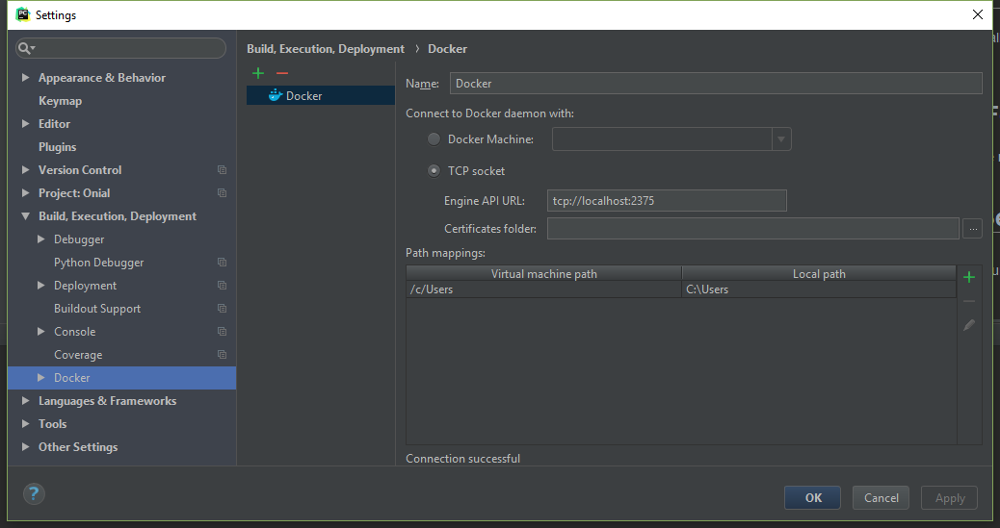
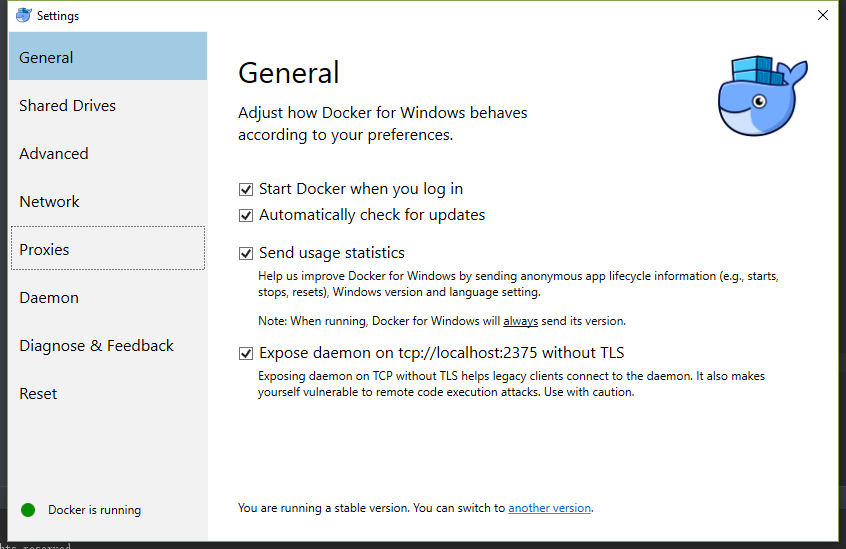
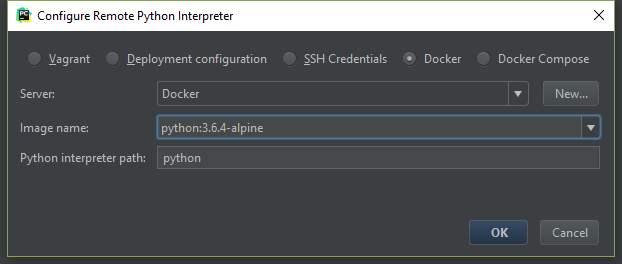
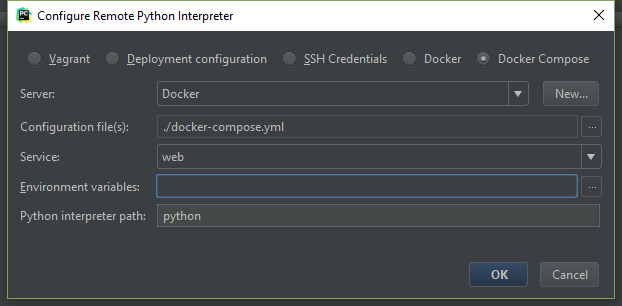

# Pycharm Debugging with remote docker container tutorial

NB: Cause of my develop environment limiting, so this tutorial is just
for windows.

## Setup

We assume you have install pycharm already! Other some words, this feature
is only supported by the **Professional** edition.

### Install Docker For Windows
You can find the reference manual here:
[Docker for Windows](https://docs.docker.com/docker-for-windows/)

## Add Docker Server with Pycharm

1. Open Docker configure page in **Settings**/**Preferences** and under
 **Build, Execution, Deployment**:

If you use docker machine to install docker, we can choose **Docker Machine**
and Pycharm will auto discover the server. Otherwise, we should choose **TCP
socket** to connect to server. Cause of we use **Docker for Windows**, so
we just leave **Certificates folder** blank. An additional step may be needed,
turn on **Expose daemon on tcp...** to make sure we can connect to docker daemon.

## Add Pycharm remote docker interpreter

After we can connect to docker, we need to use the remote interpreter as the default
interpreter.

We can find the configure page in **Settings**/**Preferences** and under
**Project/[Your Project]**. Choose **Add Remote** to add a remote interpreter.

We can have two choices to prefer.

One is setup by docker image.

It's seems so easy, choose the server we has configured before, and select the image
we produced([seems here](#build-images-and-use-docker-compose)). **Python \
interpreter path** is which python we want to use, like "/usr/bin/python" or
"/usr/bin/python3", we can also use just "python".

Another is setup by docker-compose.

Emm, it's become interesting, we just need to add a docker-compose config file
([seems here](#build-images-and-use-docker-compose)).We can learn how
to use docker-compose here:

## Build Images and Use docker-compose

Emm, needs too much words to description. Aha, already has a tutorial here:
[Using Docker Compose for Python Development](https://blog.codeship.com/using-docker-compose-for-python-development/).

And, there is another one:
[Docker-Compose: Getting Flask up and running](https://blog.jetbrains.com/pycharm/2017/03/docker-compose-getting-flask-up-and-running/)

## Conclusion

Follow steps before, we can simply use remote docker to development, it's good
for devops, but we also found some defects.

- bad performance. on my pc, it's took about 8~10s to start the remote debugger,
 it's only took 2s at local.
- not full-automatic. we must build image manually, auto-detect is needed.

We will not stop discover on this way, source code and updates will occurs
at [github](https://github.com/xuwei0455/Pycharm-Dokcer) first.